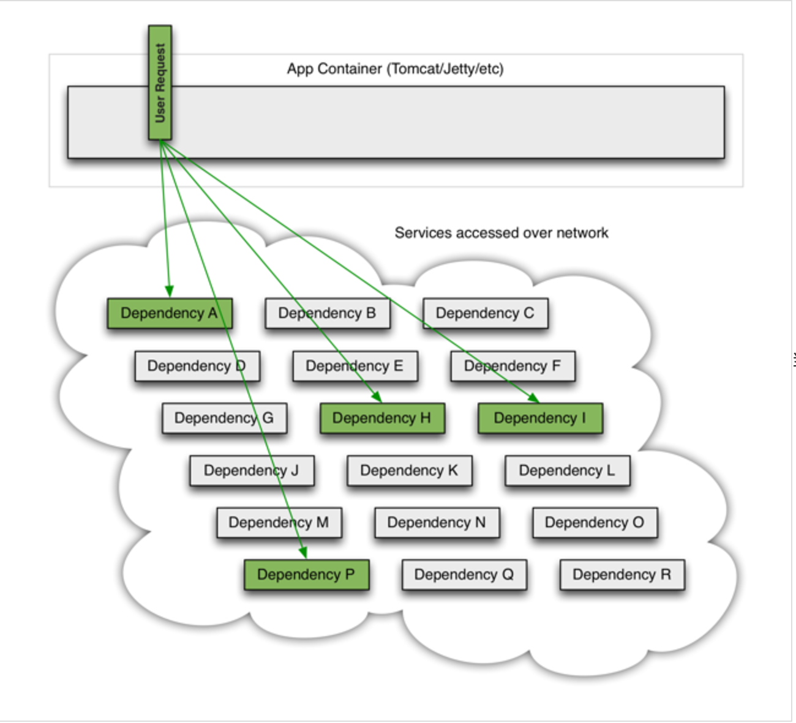
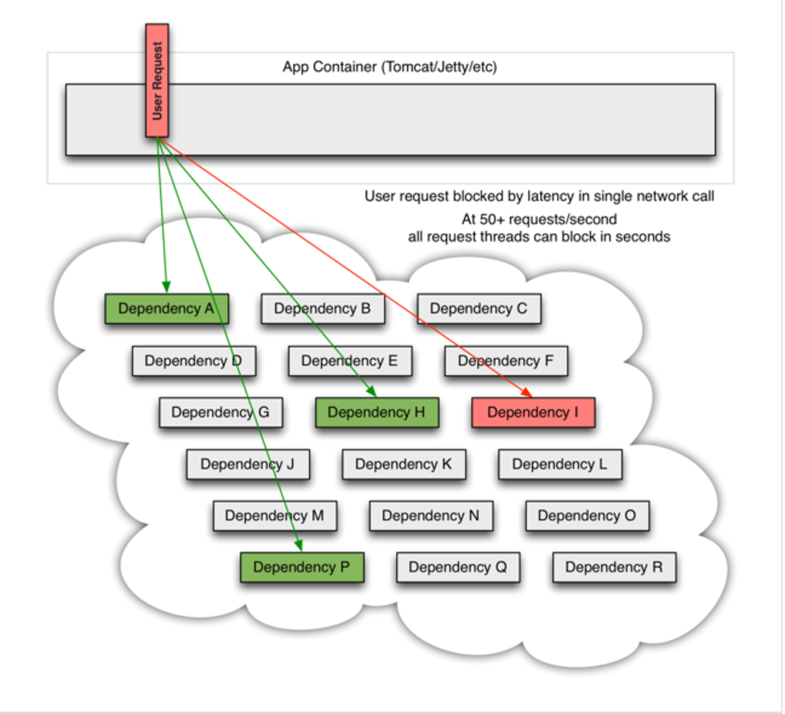
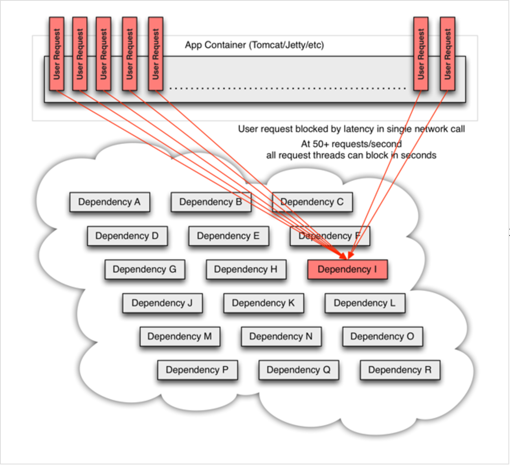

# hystrix
</br>hystrix.command.default和hystrix.threadpool.default中的default为默认CommandKey
## Spring Cloud Netflix Hystrix
Spring Cloud Netflix Hystrix是分布式系统处理超时和错误的机制

分布式系统中某个用户请求依赖A,H,I,P服务，当此请求并发超过50的时候，服务I处理速度变慢,但是服务I还是被调用.

大量请求会阻塞在Tomcat服务器上,影响其它整个服务.在复杂的分布式架构的应用程序有很多的依赖,都会不可避免地在某些时候失败.高并发的依赖失败时如果没有隔离措施,当前应用服务就有被拖垮的风险.
Spring Cloud Netflix Hystrix就是隔离措施的一种实现,可以设置在某种超时或者失败情形下断开依赖调用或者返回指定逻辑,从而提高分布式系统的稳定性.


## 参数详解
1. command properties
</br>execution相关的属性配置：
    * hystrix.command.default.execution.isolation.strategy 隔离策略，默认是Thread, 可选Thread｜Semaphore
        * thread 通过线程数量来限制并发请求数，可以提供额外的保护，但有一定的延迟。一般用于网络调用
        * semaphore 通过semaphore count来限制并发请求数，适用于无网络的高并发请求
    * hystrix.command.default.execution.isolation.thread.timeoutInMilliseconds 命令执行超时时间，默认1000ms
    * hystrix.command.default.execution.timeout.enabled 执行是否启用超时，默认启用true
    * hystrix.command.default.execution.isolation.thread.interruptOnTimeout 发生超时是是否中断，默认true
    * hystrix.command.default.execution.isolation.semaphore.maxConcurrentRequests 最大并发请求数，默认10，该参数当使用ExecutionIsolationStrategy.SEMAPHORE策略时才有效。如果达到最大并发请求数，请求会被拒绝。理论上选择semaphore size的原则和选择thread size一致，但选用semaphore时每次执行的单元要比较小且执行速度快（ms级别），否则的话应该用thread。
    * semaphore应该占整个容器（tomcat）的线程池的一小部分。
2. fallback属性
</br>这些参数可以应用于Hystrix的THREAD和SEMAPHORE策略
    * hystrix.command.default.fallback.isolation.semaphore.maxConcurrentRequests 如果并发数达到该设置值，请求会被拒绝和抛出异常并且fallback不会被调用。默认10
    * hystrix.command.default.fallback.enabled 当执行失败或者请求被拒绝，是否会尝试调用hystrixCommand.getFallback() 。默认true
3. Circuit Breaker相关的属性
    * hystrix.command.default.circuitBreaker.enabled 用来跟踪circuit的健康性，如果未达标则让request短路。默认true
    * hystrix.command.default.circuitBreaker.requestVolumeThreshold 一个rolling window内最小的请求数。如果设为20，那么当一个rolling window的时间内（比如说1个rolling window是10秒）收到19个请求，即使19个请求都失败，也不会触发circuit break。默认20
    * hystrix.command.default.circuitBreaker.sleepWindowInMilliseconds 触发短路的时间值，当该值设为5000时，则当触发circuit break后的5000毫秒内都会拒绝request，也就是5000毫秒后才会关闭circuit。默认5000
    * hystrix.command.default.circuitBreaker.errorThresholdPercentage错误比率阀值，如果错误率>=该值，circuit会被打开，并短路所有请求触发fallback。默认50
    * hystrix.command.default.circuitBreaker.forceOpen 强制打开熔断器，如果打开这个开关，那么拒绝所有request，默认false
    * hystrix.command.default.circuitBreaker.forceClosed 强制关闭熔断器 如果这个开关打开，circuit将一直关闭且忽略circuitBreaker.errorThresholdPercentage
4. Metrics相关参数
    * hystrix.command.default.metrics.rollingStats.timeInMilliseconds 设置统计的时间窗口值的，毫秒值，circuit break 的打开会根据1个rolling window的统计来计算。若rolling window被设为10000毫秒，则rolling window会被分成n个buckets，每个bucket包含success，failure，timeout，rejection的次数的统计信息。默认10000
    * hystrix.command.default.metrics.rollingStats.numBuckets 设置一个rolling window被划分的数量，若numBuckets＝10，rolling window＝10000，那么一个bucket的时间即1秒。必须符合rolling window % numberBuckets == 0。默认10
    * hystrix.command.default.metrics.rollingPercentile.enabled 执行时是否enable指标的计算和跟踪，默认true
    * hystrix.command.default.metrics.rollingPercentile.timeInMilliseconds 设置rolling percentile window的时间，默认60000
    * hystrix.command.default.metrics.rollingPercentile.numBuckets 设置rolling percentile window的numberBuckets。逻辑同上。默认6
    * hystrix.command.default.metrics.rollingPercentile.bucketSize 如果bucket size＝100，window＝10s，若这10s里有500次执行，只有最后100次执行会被统计到bucket里去。增加该值会增加内存开销以及排序的开销。默认100
    * hystrix.command.default.metrics.healthSnapshot.intervalInMilliseconds 记录health 快照（用来统计成功和错误绿）的间隔，默认500ms
5. Request Context 相关参数
    * hystrix.command.default.requestCache.enabled 默认true，需要重载getCacheKey()，返回null时不缓存
    * hystrix.command.default.requestLog.enabled 记录日志到HystrixRequestLog，默认true
6. Collapser Properties 相关参数
    * hystrix.collapser.default.maxRequestsInBatch 单次批处理的最大请求数，达到该数量触发批处理，默认Integer.MAX_VALUE
    * hystrix.collapser.default.timerDelayInMilliseconds 触发批处理的延迟，也可以为创建批处理的时间＋该值，默认10
    * hystrix.collapser.default.requestCache.enabled 是否对HystrixCollapser.execute() and HystrixCollapser.queue()的cache，默认true
7. ThreadPool 相关参数
   ```
   线程数默认值10适用于大部分情况（有时可以设置得更小），如果需要设置得更大，那有个基本得公式可以follow：
   requests per second at peak when healthy × 99th percentile latency in seconds + some breathing room
   每秒最大支撑的请求数 (99%平均响应时间 + 缓存值)
   比如：每秒能处理1000个请求，99%的请求响应时间是60ms，那么公式是：
1000 （0.060+0.012） 
基本得原则时保持线程池尽可能小，他主要是为了释放压力，防止资源被阻塞。
当一切都是正常的时候，线程池一般仅会有1到2个线程激活来提供服务  
   ```
   * hystrix.threadpool.default.coreSize 并发执行的最大线程数，默认10
   * hystrix.threadpool.default.maxQueueSize BlockingQueue的最大队列数，当设为－1，会使用SynchronousQueue，值为正时使用LinkedBlcokingQueue。该设置只会在初始化时有效，之后不能修改threadpool的queue size，除非reinitialising thread executor。默认－1。
   * hystrix.threadpool.default.queueSizeRejectionThreshold 即使maxQueueSize没有达到，达到queueSizeRejectionThreshold该值后，请求也会被拒绝。因为maxQueueSize不能被动态修改，这个参数将允许我们动态设置该值。if maxQueueSize == -1，该字段将不起作用
   * hystrix.threadpool.default.keepAliveTimeMinutes 如果corePoolSize和maxPoolSize设成一样（默认实现）该设置无效。如果通过plugin（https://github.com/Netflix/Hystrix/wiki/Plugins）使用自定义实现，该设置才有用，默认1.
   * hystrix.threadpool.default.metrics.rollingStats.timeInMilliseconds 线程池统计指标的时间，默认10000
   * hystrix.threadpool.default.metrics.rollingStats.numBuckets 将rolling window划分为n个buckets，默认10
   
## 案例
```
https://github.com/Netflix/Hystrix/tree/master/hystrix-contrib/hystrix-javanica#configuration
```
</br>java代码示例
</br>pom.xml
```
    <dependency>
      <groupId>com.netflix.hystrix</groupId>
      <artifactId>hystrix-javanica</artifactId>
    </dependency>
```

configration代码
To implement AOP functionality in the project was used AspectJ library. If in your project already used AspectJ then you need to add hystrix aspect in aop.xml as below:
```
<aspects>
        ...
        <aspect name="com.netflix.hystrix.contrib.javanica.aop.aspectj.HystrixCommandAspect"/>
        ...
</aspects>
```
If you use Spring AOP in your project then you need to add specific configuration using Spring AOP namespace in order to make Spring capable to manage aspects which were written using AspectJ and declare HystrixCommandAspect as Spring bean like below:
```
 <aop:aspectj-autoproxy/>
    <bean id="hystrixAspect" class="com.netflix.hystrix.contrib.javanica.aop.aspectj.HystrixCommandAspect"></bean>
```
Or if you are using Spring code configuration:
```
/**
 * Created by junzhang on 2017/1/21.
 */
@Configuration
public class HystrixConfiguration {
    @Bean
    public HystrixCommandAspect hystrixAspect() {
        return new HystrixCommandAspect();
    }
}
```
Javanica supports two weaving modes: compile and runtime.
Load time weaving hasn't been tested but it should work.

启动类代码
```
@SpringBootApplication
@EnableFeignClients
@EnableHystrix
@EnableCircuitBreaker
@EnableSwagger2
@EnableDiscoveryClient
public class DemoApplicationBootup {
    public static void main(String[] args){
        SpringApplication.run(DemoApplicationBootup.class,args);
    }
}

```

调用类代码
```
package neppo.com.br;

import com.netflix.hystrix.contrib.javanica.annotation.HystrixCommand;
import com.netflix.hystrix.contrib.javanica.annotation.HystrixProperty;
import org.slf4j.Logger;
import org.slf4j.LoggerFactory;
import org.springframework.beans.factory.annotation.Value;
import org.springframework.stereotype.Component;

@Component
public class HelloWorldService {

    private static final Logger log = LoggerFactory.getLogger(HelloWorldService.class);

    @Value("${name:World}")
    private String name;

    @Value("${sleepTime:10000}")
    private Long sleepTime;

    @HystrixCommand(threadPoolKey = "RestServices",
            fallbackMethod = "getHelloMessageFallback",
            commandProperties = {
                    @HystrixProperty(name = "execution.isolation.thread.timeoutInMilliseconds", value = "5000"),
                    @HystrixProperty(name = "metrics.rollingStats.numBuckets", value = "10"),
                    @HystrixProperty(name = "metrics.rollingStats.timeInMilliseconds", value = "10000"),
                    @HystrixProperty(name = "circuitBreaker.enabled", value = "true"),
                    @HystrixProperty(name = "circuitBreaker.requestVolumeThreshold", value = "5"),
                    @HystrixProperty(name = "circuitBreaker.sleepWindowInMilliseconds", value = "10000")
            },
            threadPoolProperties = {
                    @HystrixProperty(name = "coreSize", value = "1"),
                    @HystrixProperty(name = "maxQueueSize", value = "10"),
                    @HystrixProperty(name = "keepAliveTimeMinutes", value = "1"),
                    @HystrixProperty(name = "queueSizeRejectionThreshold", value = "10"),
                    @HystrixProperty(name = "metrics.rollingStats.numBuckets", value = "10"),
                    @HystrixProperty(name = "metrics.rollingStats.timeInMilliseconds", value = "10000")
            }
    )
    public String getHelloMessage() {
        log.info("Calling getHelloMessage " + System.currentTimeMillis());
       // if (true) throw new RuntimeException("Opppss");
        try {
            Thread.sleep(sleepTime);
        } catch (InterruptedException e) {

        }
        return "Hello " + this.name;
    }

    public String getHelloMessageFallback() {
        return "Hello " + this.name + " Fallback!" + System.currentTimeMillis();
    }

}
```
具体可以参见springboot-sample项目：https://github.com/zhangjun075/springboot-sample

## hystrix-dashboard
```
<dependency>
            <groupId>org.springframework.cloud</groupId>
            <artifactId>spring-cloud-starter-hystrix-dashboard</artifactId>
        </dependency>
```
```
@SpringBootApplication
@EnableEurekaClient
@EnableFeignClients
@EnableHystrix
@EnableHystrixDashboard
public class ApplicationSentence {
    public static void main(String[] args) {
        SpringApplication.run(ApplicationSentence.class, args);
    }
}
```
</br>http://127.0.0.1:8020/hystrix
</br>demo：ppdai-microservice-demo/ppdai-microservice-demo-c
</br>https://github.com/Netflix/Hystrix/tree/master/hystrix-contrib/hystrix-javanica#configuration
</br>http://cloud.spring.io/spring-cloud-static/Brixton.SR7/#_circuit_breaker_hystrix_clients