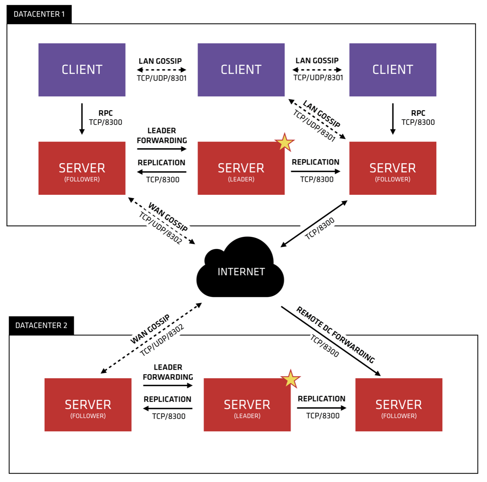

#Consul

## architecture

* (LAN:局域网 ;WAN:广域网)
* client与client之间走gossip协议，协议端口是8301
* client与server之间数据同步也是走gossip协议，端口是8301
* client与server的rpc走tcp协议，走的是8300端口
* server与server之间的复制raft协议走的是tcp协议，端口是8300
* 不同的dc之间的数据请求走的是8300端口
* 不同的dc的server之间走的gossip协议，端口广域网的8302端口

## Glossary
* Agent - An agent is the long running daemon on every member of the Consul cluster
* Client - A client is an agent that forwards all RPCs to a server
* Server - A server is an agent with an expanded set of responsibilities including participating in the Raft quorum, maintaining cluster state, responding to RPC queries, exchanging WAN gossip with other datacenters, and forwarding queries to leaders or remote datacenters.
* Datacenter - While the definition of a datacenter seems obvious, there are subtle details that must be considered
* Consensus - When used in our documentation we use consensus to mean agreement upon the elected leader as well as agreement on the ordering of transactions.
* Gossip - Consul is built on top of Serf which provides a full gossip protocol that is used for multiple purposes. Serf provides membership, failure detection, and event broadcast. Our use of these is described more in the gossip documentation. It is enough to know that gossip involves random node-to-node communication, primarily over UDP.
* LAN Gossip - Refers to the LAN gossip pool which contains nodes that are all located on the same local area network or datacenter.
* WAN Gossip - Refers to the WAN gossip pool which contains only servers. These servers are primarily located in different datacenters and typically communicate over the internet or wide area network.
* RPC - Remote Procedure Call. This is a request / response mechanism allowing a client to make a request of a server.
